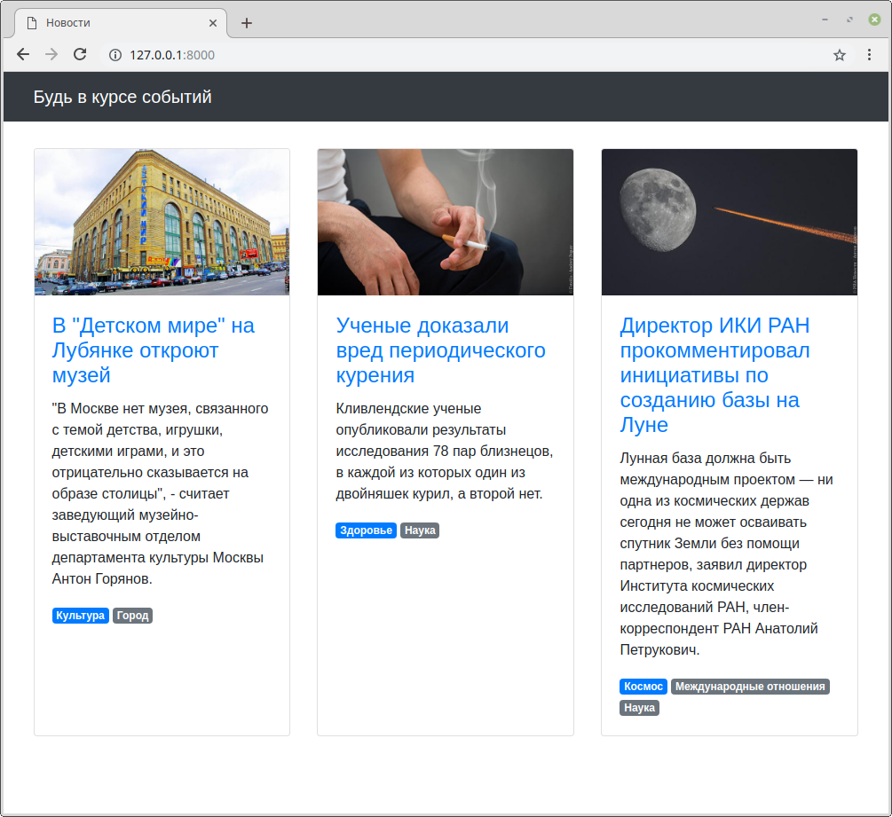

## Задание

Есть небольшой новостной сайт.


Было решено к статьям добавить тематические резделы, к которым они относятся, и отображать их у каждой новости в виде списка тегов.



У каждой статьи может быть несколько разделов, но всегда один из них должен быть основным.
В списке тегов он должен идти первым, потом все остальные в алфавитном порядке.

В админке необходимо реализовать создание разделов и для страницы _Редактирование статьи_ добавить возможность указывать разделы.
Необходимо также реализовать проверку на наличие одного и только одного основного раздела.


## Примечание

* `Tag` — просто тег, только его название, ничего более;
* `Article` — статья с текстом, заголовком, картинкой и пр. + набор тегов (многие ко многим);
* `Scope` — таблица-связка между статьей и тегом. Именно здесь должно быть свойство `is_main`.

---

## Документация по проекту

Для запуска проекта необходимо

Установить зависимости:

```bash
pip install -r requirements.txt
```

Провести миграцию:

```bash
python manage.py migrate
```

Загрузить тестовые данные:

```bash
python manage.py loaddata articles.json
```

Запустить отладочный веб-сервер проекта:

```bash
python manage.py runserver
```
